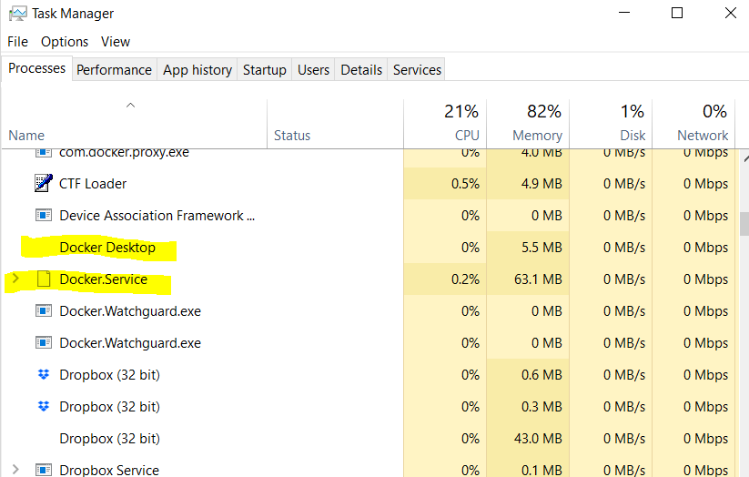

# FAQ

## Docker cannot start
Docker for windows sometimes fails to start.  
In this case, `docker-compose up` may not start wasi and Jupyter environment.  
For solving this situation, `Docker app` and `Docker engine` need to be killed from the task manager as below,  
   
then start docker again from start menu.  

Docker may also not be started when Windows update is suspended.  
So please try restart the computer if killing and restarting Docker does not work.  

## C or D drive cannot shared
At the first time of `docker-compose up`, Docker requires sharing C or D drive.  
Sometimes, because of user account's rule, C or D drive cannot shared even if using administrator.  
This case may be solved by creating a local account.  
In some case, this local account cannot be appeared in the login screen, which is no problem.  
This local account's name and password are used only when Docker asked you to share the C or D drive, but not necessary to login with it.  

