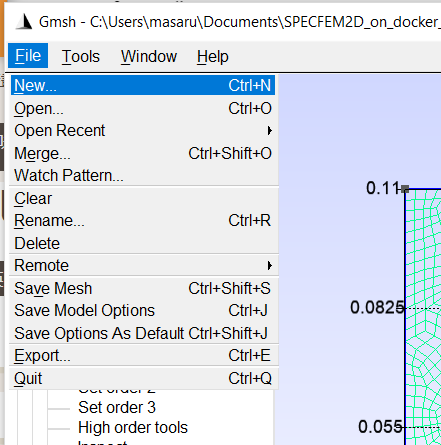

# Meshing tutorial

In this page, reader may find a simple example of meshing method with Gmsh. As the mesh generation function is separated from the function of Toolbox wasi, here only a minimum amount of examples are provided. Users may go to the [official documents](http://gmsh.info/doc/texinfo/gmsh.html) of Gmsh to find further functions of this great software Gmsh.


## Example 1: homogeneous medium with a hole
At first, we will create a mesh for modeling a homogeneous medium with a hole as the image below:  

  

This model has a rectangular shape and a hole in the rectangular. this hole will be a void (no material), thus this circular boundary will reflect 100% of energy. This kind of meshing may be used for modeling 2 materials which has greatly different impedance e.g. metal and air.

### 1-1: setting of characteristic length
After openning Gmsh application, we starts from creating a new geometry file from "New" at the menu bar above the application window:  

  

For the place to place the geometry file, it is useful to put it in the same directry with the Jupyter notebook file (.ipynb) of your simulation. A geometry file in .geo extension will be generated at the selected place.

When the new geometry file is opened, Gmsh ask us which type of geometry kernel is used for the geometry definition (`OpenCASCADE` or `Built-in`).   

  

We can use both type of geometry kernels for meshing. For this example, we select `OpenCASCADE` as this kernel may do boolean operation easily than the other kernel.

Then we define parameters which will used to decide the mesh size or some part of geometry. In this example, we will make 2 parameters:
```
lc :  element size
rc :  radial of a hole
```
For this step, you may put any name for any parameter as you want.

Parameters may be defined from the left function tree, Modules->Geometry->Elementary entities->Add->Parameter.  

  

In this image, the parameter `lc` is defined with the initial value `0.0005`.  
In `Name` box, you can put the name of this parameter.  
`Label` and `Path` may be used for grouping the parameters which is useful for handling many parameters. We don't use them for this example as we use only 2 parameters.

### 1-2: Definition of nodes
Here we define four corner points composing the rectangular shape at:
```
point 1 = 0.0, 0.11
point 2 = 0.0, 0.0
point 3 = 0.15, 0.0
point 4 = 0.15, 0.11
```

For define a node, we use the function Modules->Geometry->Elementary entities->Add->Point:  

  

The image above is the window defining the first node. In the forth box for defining a mesh size around the defining node, we can put the parameter names defined in the former step. After filling these boxes, pushing `Add` button creates a node.

  

This image above shows the 4 nodes defined in this step. Initially the names of nodes are not indicated. To do so, configure Tools on the upper menu bar->Tools->Options->Geometry->Visibility. 

### 1-3: Definition of lines
After defining the node points, we will define lines by connecting two nodes for one line. We define 4 lines:
```
line 1 = point 1, 2
line 2 = point 2, 3
line 3 = point 3, 4
line 4 = point 4, 1
```
Definition of lines is done from Modules->Geometry->Elementary entities->Add->Lines then select 2 points for each line by clicking directly on the GUI window. The image below is the appearance after line definition.

  

Then we will also define a circle which will be a hole later. A circle may be generated from Modules->Geometry->Elementary entities->Add->Circle

  


### 1-4: Definition of line groups and surface
At this moment, the geometry includes only some nodes and lines. By using them, we define surfaces where mesh will be generated and physical characteristics may be assigned.  
Definition of a surface may be done from clicking Modules->Geometry->Elementary entities->Add->plane Surface then chose lines which will be boundaries of this surface. 
At first, we make only the surface of the rectangular area without hole by selecting like:

  

then press `e` to finish the definition of one single surface.
After this, the circle area is also converted to be another surface with the same way:

  


### 1-5: boolean operation
Now we have 2 plane surfaces, one is the rectangular area without hole and one circular area which will be a hole.
In order to make rectangular geometry, we carry out a boolean difference from Modules->Geometry->Elementary entities->Boolean->Difference to cut the circle out from the rectangle. Please make it sure that the check box status for erasing the original objects is as:

  

then select the plane surface that will be the actual surface but not a hole part. `plane 1` in this case. Looks of the Gmsh window after this selection will be:

  

Press e to finish the selection of the first plane surface.
Next selection is for the part which will be a hole. Please select the hole part `Plane 2` as:

  

then finish the boolean difference with tapping the key `e` then `q`. 
This boolean difference creates a new plane surface with a hole, and erased the original 2 plane surfaces i.e. rectangle and circle.


### 1-6: Definition boundary conditions and material flags
We need to define the physical names of outer boundary of the meshing region, which SPECFEM requires to recognize the ends of the simulation domain. We define the 4 physical names for each 4 bounds with exactly the same name as:
```
(tag name: explain)
Left   : left edge of the domain.
Bottom : lower edge of the domain.
Right  : right edge of the domain.
Top    : upper edge of the domain
```

This process can be done from  Modules->Geometry->Physical Groups->Add->Curve as this image below:

  

by putting the name of the tags in the box and selecting the target boundary line, then pressing `e` to finish this process. Please define all 4 defintions with the same way.

You can verify the defined names of physical curves on the GUI:

  

Next, we will define the physical tags for the plane surfaces with the rule of:

```
M1 : for the first material 
M2 : for second ...
...
Mn : for n-th material
```

Please pay an attention that the number of material need to be matched with the material id when you configured in WASI user interface.

Definition of a physical surface may be done from Modules->Geometry->Physical Groups->Add->Surface like:

  

 
### 1-7: Meshing

Before generating a mesh, we need to setup 2 things,
```
1. define the element size.
2. specify the type of mesh as quad 
``` 

The element sizes may be defined from Modules->Mesh->Size at Points

  

In the image, the element size at all nodes are defined to be equal the number of the parameter `lc` which we defined at the first step of this example.

In the next step, we specify the finite element type which Gmsh generates. Because SPECFEM supports only Quad elements, we need to change the setting of Gmsh as so.
This configuration may be modified from the top menu bar Tools->Options->Mesh->General then set the parameters as the image below:

  

Then user may generate the all-Quad mesh from Modules->Mesh->2D
The result of meshing is indicated as:

  

In the case you find partially small elements, you may try to smooth them from Modules->Mesh->Smooth 2D.

As we prepared 2 parameters i.e. the radius of the hole and mesh element size, they are easily modified as:

  

In this image, the radius is set to larger and mesh size is changed to be smaller.

After finishing the generation of the mesh, mesh file may be saved from Modules->Mesh->Save then Gmsh creates a `.msh` file.
In order to use this mesh file, it is necessary to move this file into the simulation directory (i.e. where your jupyter notebook, for simulation configuration, is placed.), and verify the file name before .msh part is exactly the same with the `file name` which you put in the simulation configuration step.

### 1-8: The way to mesh a large model (without GUI)

Depending on the amount of RAM and graphics, sometimes meshing of a model with the great number of meshes is not possible to be visualized by GUI of Gmsh. In that case, we can use a terminal command of Gmsh.

Before using gmsh cui command, we need to add only 2 lines at the end of the `.geo` file.
The lines to be added is here:
```
Mesh.SubdivisionAlgorithm=1;
Recombine Surface "*";
```

then we open the terminal on Jupyter lab, then run the command below:

`gmsh -2 yourgeofile.geo -o yourmeshfile.msh`

This command will generate the mesh file.


## Example 2: heterogeneous medium  (e.g. hole filled with oil)

In this example, we prepare a mesh for a heterogeneous model i.e. a simulation domain composed with multiple material.
We will use the same shape of geometry thus the step the explanation for this example starts from just after the section 1-4 Definition of line groups and surface.

### 2-5: Boolean operation

In stead of just cutting off the circle area, this example fills in this circle with another material.
Instead of boolean difference, we use here boolean fragment for keeping the plane surface inside of the circle.

The initial preparation process is same with Example 1 thus please follow the instruction from 1-1 to 1-4.

### 2-6: Definition boundary conditions and material flags
In order to keep the surface of the circle, we use the boolean fragments, from Modules->Geometry->Elementary entities->Boolean->Fragments.
Firstly please select the rectangle and press `e`, then select the circle and `e`. After selecting the circle, the appearance of Gmsh window is like :

  

### 2-7: Meshing

The setting of mesh element size may be done with exactly the same way with 1-7 thus you may go back to Example 1 then finish meshing.
Please pay attention that you need to define the 2 physical surface, namely not only `M1` for the rectangle but also `M2` for the circle.

The generated mesh will be like this image:

  


## Example 3: 3D mesh
In this example, we will make a 3D mesh model by extruding the 2D surface which we have made in Example 1.  
Thus this example starts after the section 1-5 (Boolean opperation).  
However for 3D geometry, boundary condition flags (i.e. top, bottom, left, right) are not necessary.  
Thus only material flags (M1, M2) are necessary.  

### 3-1: Extrusion
For extrusion, select Geometry->Extrude->Transpose.  
Then select a plane which will be extruded.  
On the newly opened window, configure the amount of extrusion for x,y,z direction and select the number of layer (elements). 
At this point, we can again use the self-defined parameters e.g. `lc` for the target element size.

  

The image below is the result of this step.  

  


### 3-2: Material flags
We will do the same process with the section 1-6.  
However for 3D geometry, boundary condition flags (i.e. top, bottom, left, right) are not necessary.  
Thus only material flags (M1, M2) are necessary.  

### 3-3: Meshing
Finally by selecting Mesh->3D, meshing will be finished as,  

  

