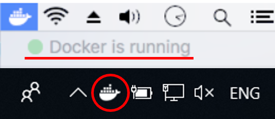
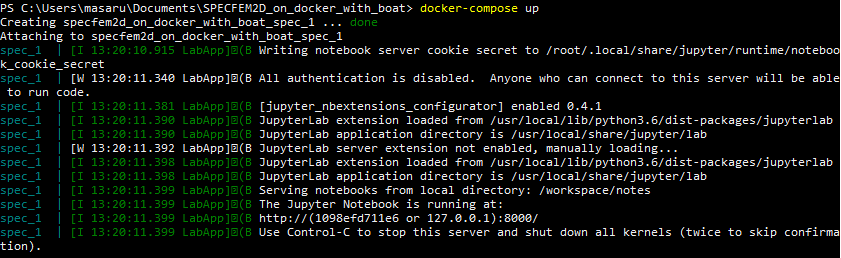
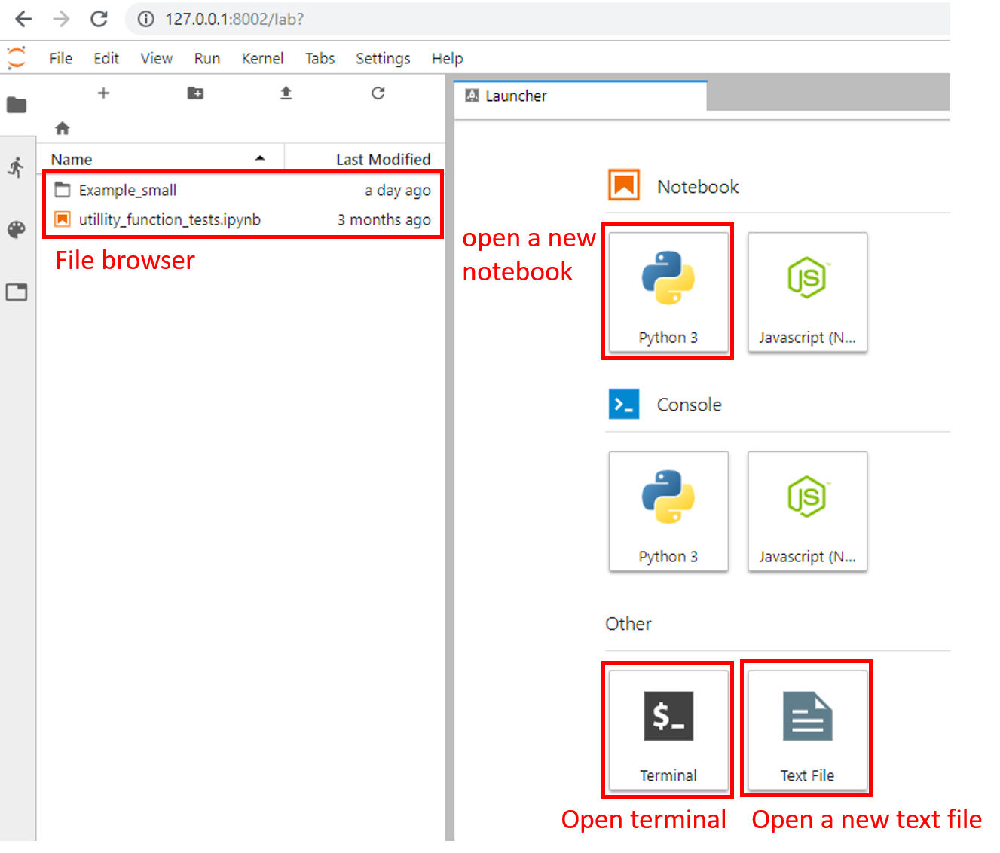

# Tutorial

In this page, an example of entire calculation with this library is indicated with a small geometry.

## 1. Check if the docker daemon is running. 

On linux, it is ok if the command `docker ps` (in the terminal) indicates a list of docker images. On OSX and Windows, the state of the daemon can be seen on the menu bar as this image:  

  

## 2. Start docker container

Initialization of the colculation environment for use of this library is quite simple.  
At first, please open the terminal or Power shell (windows) and navigate it to the directory of this library by running the command (file location is assumed to be at `Documents/wasi`)
```bash
cd ~/Documents/wasi/SPECFEM2D_with_boat-master
```

Then start the docker container (the environment packaged with docker) by the command 
```bash
docker-compose up
```
This command will be finished instantly.  
After finishing it, you may see the indication like below:

   

When starting 3D wasi, we can do the same thing with just modify the file path as
```bash
cd ~/Documents/wasi/SPECFEM3D_with_boat-master
```
then  
```bash
docker-compose up
```


## 3. Open jupyter lab on your internet browser (chrome etc.)

After starting the docker container, user may open Jupyter lab screen on a web browser by accessing the url below:

Wasi 2D
```
127.0.0.1:8002
```

and Wasi 3D
```
127.0.0.1:8001
```


## 4. Explanation about Jupyter lab

The appearance of Jupyter lab is below,  
   

A file browser is on the left side. At the initial time, you may find only one single example directory on the list. You can add any files or directory from the buttons above or by drag and drop directly on this browser.  
Some buttons on the right side are for creating a new jupyter notebook file or a text file, or starting python console.  
A terminal window may be openned from the button below, which is directly opened form the docker environment thus it is useful to e.g. installing additional libraries or erasing files etc.  

`Example_small` directory includes the files for making a small simulation as an example.
After entering this folder by double clicking in the file browser

Detailed explanation on how to use the user interface etc. are described in the notebook file `example_small.ipynb` in this directory. 